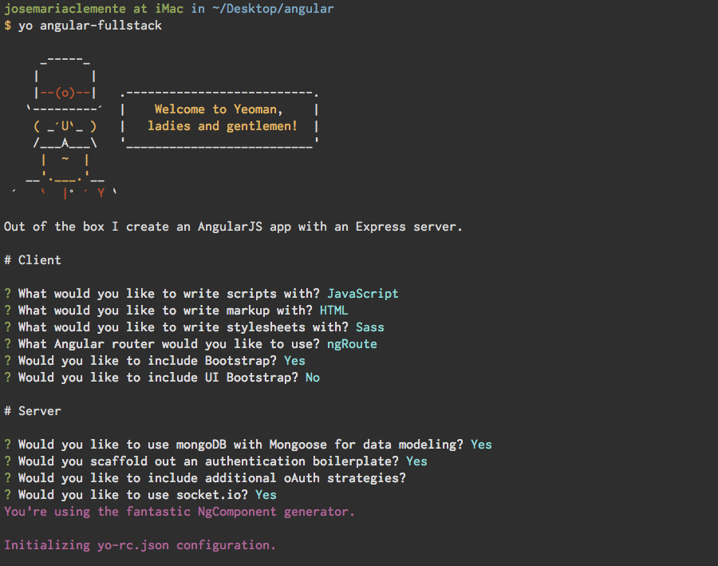
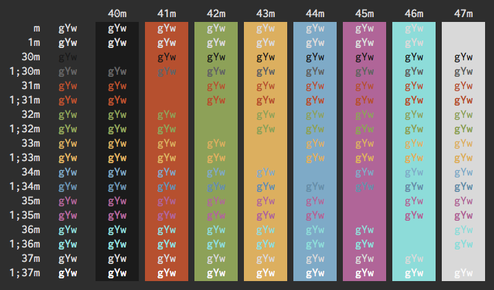

# Afterglow iTerm Color Scheme

A color scheme for [iTerm2](http://iterm2.com/) based on [Afterglow Theme for Sublime Text](https://github.com/YabataDesign/afterglow-theme).

## Screenshots




## Install 

### Install using Git

Clone the repository:

```bash
$ git clone https://github.com/yabatadesign/afterglow-itermcolors/
```

### Install manually

Download the [GitHub .zip](https://github.com/yabatadesign/afterglow-itermcolors/archive/master.zip) and unzip them.

## Activating theme

1. `iTerm2 > Preferences > Profiles > Colors Tab`
2. Click `Load Presets`
3. Click `Import`
4. Select the `iterm/Afterglow.itermcolors` file
5. Select the Afterglow from `Load Presets`
